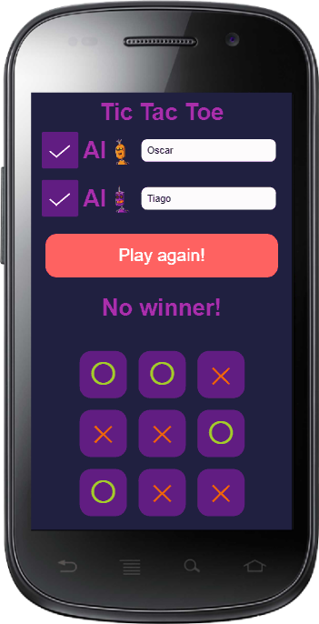

# 🎮 The game of Tic-Tac-Toe

[](https://oscarnava.me/tictactoe/)

An online Tic-Tac-Toe game with a built-in AI. If you have been living under a rock 😁 and you don't know this game and its rules, you can check them out at [this link](https://en.wikipedia.org/wiki/Tic-tac-toe).

To start a game, type the name of the players in the corresponding editor (the corresponding avatar will change depending on your name), select whether you want to play against a human 👦↔👧, the computer 👧↔🤖, or you can even select both players to be AI's 🤖↔🤖.

Do you want to try it now? You can play the game at this link: 🕹 [Tic-Tac-Toe](https://oscarnava.me/tictactoe/).

---
## 👤 Contributors

- [Oscar Nava](https://github.com/oscarnava) 📧 contact@oscarnava.me
- [Mauricio Robayo](https://github.com/MauricioRobayo) 📧 hi@mauriciorobayo.com

## 🔗 Assignment link

- [Project: TicTacToe](https://www.theodinproject.com/courses/javascript/lessons/tic-tac-toe-javascript)

---

## 🔧 Installing

After cloning the repository to your local development machine, to build the application you will have to install dependencies and run **Parcel**:
```
npm install
npx parcel index.html
```
And open the location http://localhost:1234/ with your browser.

## 🔨 Building the App
Enter on the command line:

`parcel build index.html --public-url ./`

Application will be built in the _**dist**_ directory.

---

## ⌛ Todo's

- [ ] Improve the AI to be unbeatable by using MinMax algorithm (currently it uses a simple Montecarlo strategy)

## 📦 Contributing
Contributions, issues and feature requests are welcome!

Feel free to check the [issues page](https://github.com/oscarnava/Battleship/issues).

## 🗝 License
Creative Commons [Attribution 4.0 International (CC BY 4.0)](https://creativecommons.org/licenses/by/4.0/).

## 📡 Contact

Please don't hesitate to contact me at 📧 [contact@oscarnava.me](mailto:contact@oscarnava.me) if you have any questions, comments, etc. I would love to know what's on your mind!
